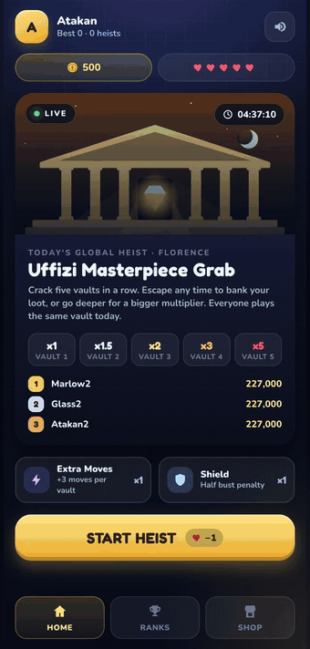
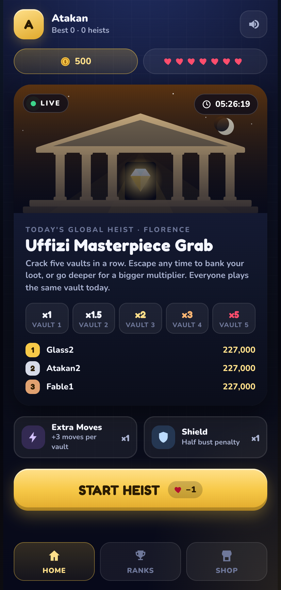
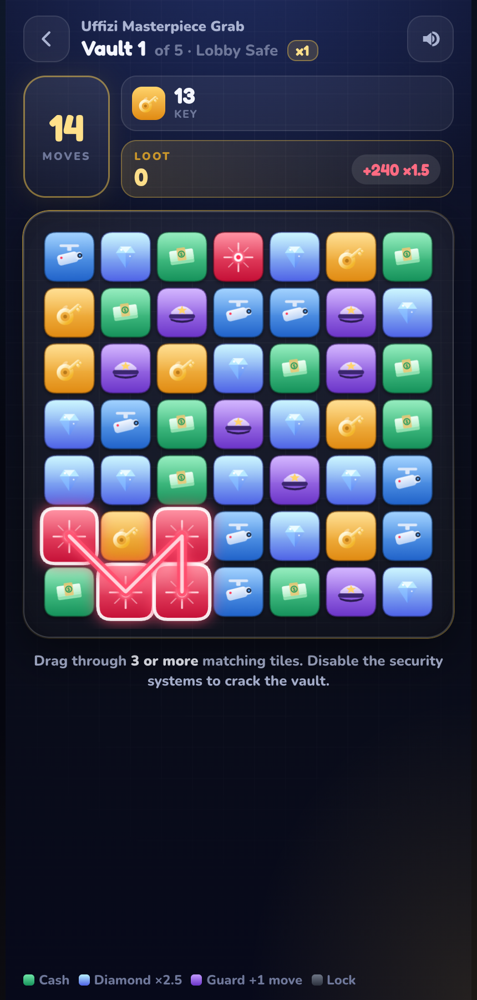
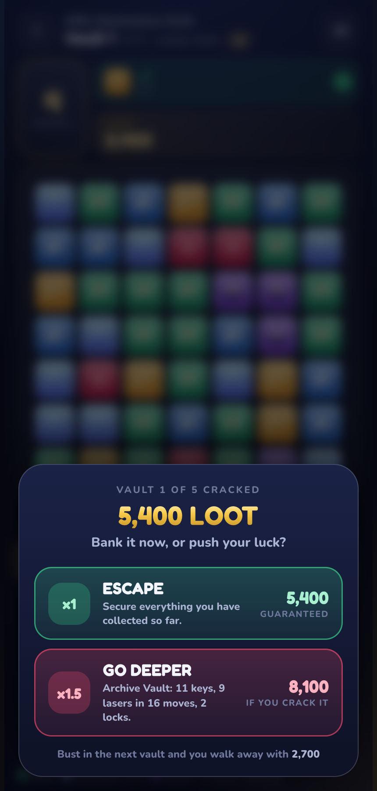
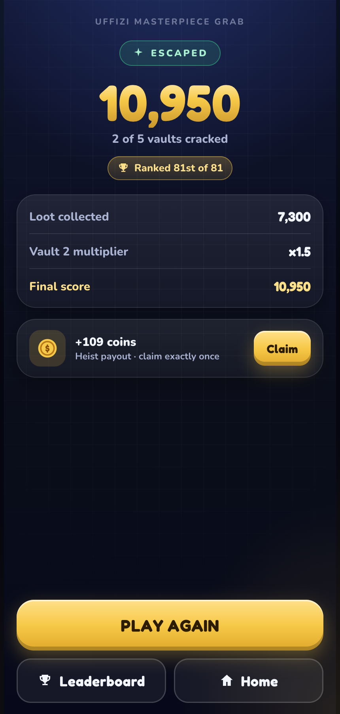
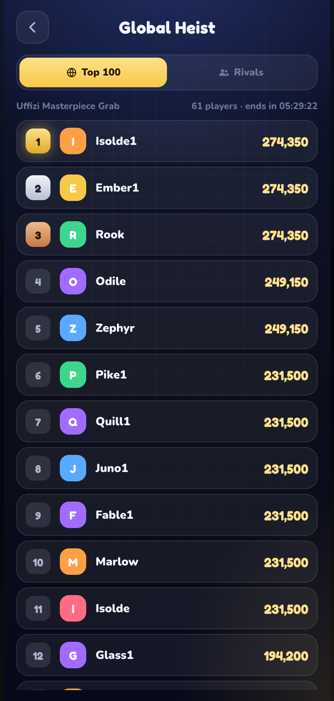
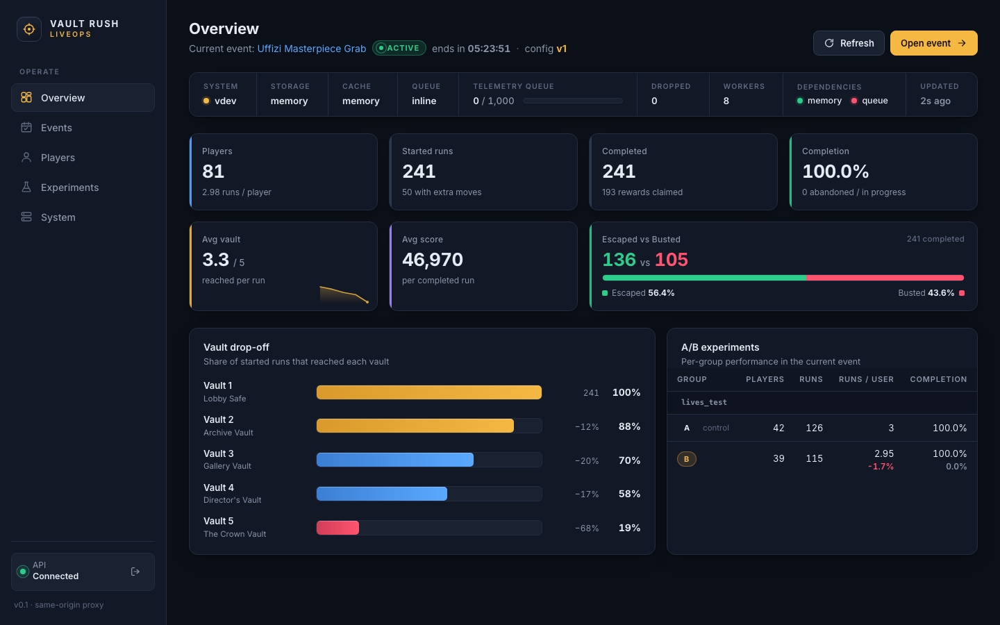
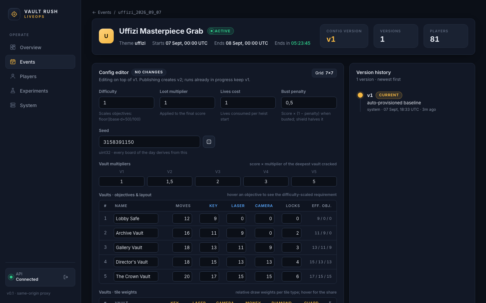
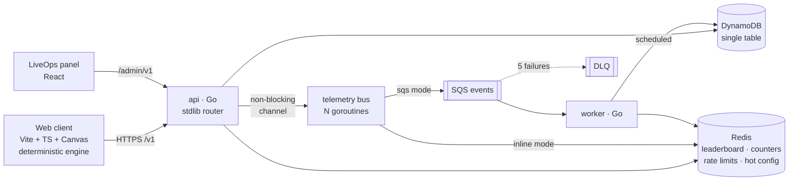

# Vault Rush — Live Heist Puzzle Platform

A casual mobile heist-puzzle game whose real product is the backend: a production-style
**Go game-services platform** (DynamoDB, Redis, SQS, goroutine pipelines, idempotent
APIs, versioned LiveOps config) with a **deterministic engine shared between client and
server**, a **React LiveOps dashboard**, Docker/Terraform/GitHub Actions delivery, and
load tests with real, reproducible numbers.

<p align="center">
  
</p>
<p align="center">
  <a href="docs/media/vault-rush-demo.mp4">▶ Full 80-second gameplay video (MP4)</a> — welcome → heist start → two vaults → decision → result → leaderboard, recorded against the real API.
</p>

<p align="center">
  
  
  
  
  
</p>
<p align="center">
  
  
</p>

## The game in one minute

Every day all players get the **same Global Heist** — one museum, one seed, five vaults.
A vault is a 7×7 board of keys, lasers, cameras, cash, diamonds, guards and locks; you
drag through 3+ matching tiles to chain them. Disable the security objectives within the
move limit to crack the vault, then decide:

- **Escape** — bank your loot at the current multiplier (x1, x1.5, x2, x3, x5), or
- **Go deeper** — the next vault is harder; get busted and you keep only half.

The client simulates the run locally. When it finishes, it sends the **moves**, not the
score. The server replays every move with the same engine and produces the only score the
leaderboard will ever see.

## Why this project looks the way it does

It was built for a backend-leaning game-services role. Each requirement from that posting
maps to something concrete here:

| Requirement | Where it lives |
|---|---|
| Go, goroutines, channels | `backend/` — stdlib `net/http`, a buffered-channel telemetry bus with a worker pool ([`internal/telemetry`](backend/internal/telemetry/bus.go)) |
| Distributed / shared game services | Player, gameplay, leaderboard, rewards, shop, LiveOps services behind one API; a separate worker consumes SQS |
| High performance, low latency | Redis sorted-set leaderboard, cached immutable configs, non-blocking publish; `finish` replays a 70-move run in ~25 µs ([benchmark](backend/pkg/engine/engine_test.go)) |
| Fault tolerance | Idempotency keys, optimistic concurrency, conditional writes, retry with backoff, DLQ, graceful shutdown, fail-open rate limiter |
| AWS | DynamoDB single-table design, ElastiCache Redis, SQS + DLQ, ECS Fargate, ALB, S3/CloudFront — all in [Terraform](infrastructure/terraform) |
| NoSQL / in-memory DB | [`store/dynamo`](backend/internal/store/dynamo/dynamo.go) and [`cache/redis`](backend/internal/cache/redis/redis.go), each behind a port with a conformance suite |
| DevOps, CI/CD | Multi-stage distroless images, `docker compose up`, [GitHub Actions](.github/workflows) (lint, race tests, integration services, image builds, ECS deploy) |
| Internal tools | [LiveOps admin panel](admin/) — config versioning with diff + confirm, analytics funnel, A/B table, player lookup, system health |
| Data analysis | Telemetry → per-event counters → drop-off funnel and A/B comparison on the dashboard |

## Architecture



Three backing modes are selected purely by environment variables — the same binaries
run against in-memory fakes (`STORAGE=memory CACHE=memory QUEUE=inline`), the local
compose stack (DynamoDB Local, Redis, ElasticMQ) and AWS. The memory adapters pass the
**same conformance suites** as the DynamoDB and Redis adapters, which is what makes the
service tests trustworthy.

Full detail with sequence diagrams: [docs/architecture.md](docs/architecture.md).

## The interesting parts

**Deterministic replay as anti-cheat and storage optimisation.** A run is stored as
`{runId, playerId, seed, configVersion, boosters}` — never a board. Both engines
([Go](backend/pkg/engine), [TypeScript](client/src/engine)) use the same mulberry32 RNG
and integer-only rules; a golden-fixture test generated by Go and asserted by Vitest keeps
them bit-identical across boards, every intermediate step and final scores. `finish`
rejects a tampered score with `422 SCORE_MISMATCH` and an illegal move with
`422 INVALID_REPLAY` ([docs/engine.md](docs/engine.md)).

**Idempotency.** Mutating endpoints accept `Idempotency-Key`. The key is reserved with a
conditional write before any side effect; a retry after a lost response gets the stored
body back with `Idempotent-Replayed: true`. A finish without a key is still safe because
`ACTIVE → FINISHED` is a conditional state transition.

**Optimistic concurrency.** Profiles carry a `version`; every write is
`UPDATE … WHERE version = :expected`. Two concurrent purchases that together exceed the
balance can never both succeed — [tested with 50 goroutines](backend/internal/shop/service_test.go).

**Exactly-once rewards.** Claiming flips `PENDING → CLAIMED` conditionally; 100
concurrent claims yield exactly one payout — [tested at the service layer and over HTTP](backend/internal/httpapi/server_test.go).

**Config versioning.** LiveOps edits never overwrite: publishing creates version N+1 and
moves the event's pointer, while active runs keep the version they started with.
Changing vault difficulty mid-run cannot break anyone's heist —
[tested](backend/internal/httpapi/server_test.go) (`TestConfigVersionPinning`).

**Asynchronous telemetry.** The request path does one non-blocking channel send. Workers
fan out to sinks (analytics counters, leaderboard `ZADD GT`, or an SQS publisher) with
exponential backoff; the bus drains on shutdown and exposes depth, drops, retries on
`/metrics`. Redis being down never fails a `finish`.

**Graceful shutdown.** SIGTERM → `/readyz` flips to 503 → in-flight requests complete →
telemetry channel drains → connections close, all inside the ECS `stopTimeout`.

**A/B experiments.** Group assignment is a pure hash of the player id (no assignment
table); the lives experiment (5 vs 7) shows up as a per-group table on the dashboard.

Decisions and their trade-offs are recorded as ADRs in [docs/decisions](docs/decisions).

## Run it

**Zero dependencies (in-memory adapters):**

```bash
make dev-api          # Go API on :8080 with STORAGE=memory CACHE=memory QUEUE=inline
make dev-client       # game on http://localhost:5173
make dev-admin        # LiveOps panel on http://localhost:3000 (token: local-admin-token)
make seed             # 200 bot players play real heists → populated leaderboard & funnel
```

**Full stack (DynamoDB Local, Redis, ElasticMQ, api, worker, client, admin):**

```bash
docker compose up --build
```

| Service | URL |
|---|---|
| Game | http://localhost:8081 |
| LiveOps panel | http://localhost:8082 (token `local-admin-token`) |
| API | http://localhost:8080 — `/healthz`, `/readyz`, `/metrics` |
| Worker metrics | http://localhost:8083/metrics |

Host ports are overridable (`API_PORT=8090 docker compose up`); see [`.env.example`](.env.example).
Environment variables are documented in [docs/operations.md](docs/operations.md).

## Tests

```bash
make test              # Go unit tests + client engine golden fixtures
make test-race         # Go tests under the race detector, with coverage
make test-integration  # conformance suites against Redis + DynamoDB Local (compose up first)
make lint              # gofmt, go vet, staticcheck, TypeScript typecheck
```

What is covered:

- **Engine** — RNG reference values, board generation, move validation, scoring, bust and
  crack transitions, tamper rejection, cross-language golden fixtures (8 scenarios, every
  step asserted in both Go and TypeScript).
- **Stores and caches** — one conformance suite per port, run against memory and against
  DynamoDB Local / Redis: device uniqueness, version conflicts, exactly-once finish and
  claim, immutable config versions, idempotency records, sorted-set ordering, token
  bucket, TTLs.
- **Services** — 100 concurrent claims pay once; 50 concurrent purchases never overspend;
  retries on version conflicts never lose updates; life regeneration; config publish and
  pinning.
- **HTTP** — full heist flow with idempotent replay, the seven-step finish validation
  chain, auth and admin guards, rate limiting per player, analytics convergence.
- **Telemetry bus** — every event reaches every sink once, transient errors retry,
  permanent errors do not, full buffer drops instead of blocking, shutdown drains and
  honours its deadline.

## Load tests

k6 scripts live in [load-tests/k6](load-tests/k6). `heist-flow.js` is not a synthetic
ping: each virtual user creates a player, starts a heist, **plays it with the real engine**
(bundled from the client), submits the replay, retries it to prove idempotency and claims
the reward. Measured on this machine (see [docs/load-testing.md](docs/load-testing.md)
for the method and full output):

| Target | Script | Load | req/s | p50 | p95 | p99 | Errors | Checks |
|---|---|---|---|---|---|---|---|---|
| Go API, in-memory adapters | `leaderboard.js` — `GET /v1/leaderboard/global` | 200 VUs · 60 s | 269 | 1.1 ms | 10.8 ms | 20.1 ms | 0 / 16,200 | 100 % |
| Go API, in-memory adapters | `heist-flow.js` — `POST …/finish` (server replay) | 100 VUs · 60 s | 319 | 0.4 ms | 7.8 ms | 24.5 ms | 0 / 19,570 | 100 %, 0 score mismatches |
| Compose: DynamoDB Local + Redis + SQS | `leaderboard.js` — `GET /v1/leaderboard/global` | 200 VUs · 60 s | 262 | 4.0 ms | 28.9 ms | 90.3 ms | 0 / 16,116 | 100 % |
| Compose: DynamoDB Local + Redis + SQS | `profile.js` — `GET /v1/player/profile` | 200 VUs · 60 s | 134 | 5.5 ms | 53.5 ms | 158 ms | 0 / 8,200 | 100 % |
| Compose: DynamoDB Local + Redis + SQS | `heist-flow.js` — `POST …/finish` | 25 VUs · 60 s | 73 | 53 ms | 139 ms | 174 ms | 0 / 4,475 | 100 %, 0 score mismatches |
| Compose: DynamoDB Local + Redis + SQS | `heist-flow.js` — `POST …/finish` | 100 VUs · 60 s | 182 | 420 ms | 914 ms | 1,170 ms | 0 / 11,175 | 100 %, threshold p95<300 ms **failed** |

Read the last two rows together: the compose stack saturates between 25 and 100 concurrent
heist-finishing players, and `docker stats` during the 100-VU run shows why — the DynamoDB
Local and ElasticMQ JVMs each pin a CPU core while the Go API stays under one core and
Redis idles at 5 %. The same flow against the in-memory adapters sits at p95 7.8 ms, so the
cost is in the emulators and SDK round-trips, not in the replay or handlers. During that
run the telemetry pipeline published 14,599 events and the SQS worker processed all 14,599
with zero drops or retries. Machine: Apple M1 Pro, 10 cores, 16 GB, Docker Desktop with
10 CPUs / 7.75 GB; k6 on the same host over loopback — regression baselines, not production
latencies.

## Repository layout

```
backend/            Go module: cmd/api, cmd/worker, cmd/seed, internal/*, pkg/engine
client/             Vite + TypeScript game client, Canvas board, engine port + fixtures
admin/              Vite + React LiveOps panel (with a zero-dependency mock API)
infrastructure/     docker/ (images, nginx, ElasticMQ), terraform/ (AWS, modules)
load-tests/k6/      smoke, profile, leaderboard, heist-flow (deterministic bot)
docs/               architecture, api, engine, operations, load-testing, decisions/ADR-*
.github/workflows/  ci.yml, deploy.yml, load-test.yml
docker-compose.yml  full local stack
Makefile            every command used above
```

## Documentation

- [Architecture](docs/architecture.md) — components, request path, telemetry pipeline, data model, consistency, fault tolerance, shutdown
- [API reference](docs/api.md) — every endpoint, error code and payload
- [Engine specification](docs/engine.md) — the normative rules both implementations follow
- [Operations runbook](docs/operations.md) — env vars, Redis down, DLQ replay, scaling knobs
- [Load testing](docs/load-testing.md) — method and results
- ADRs: [Go](docs/decisions/ADR-001-go.md) · [DynamoDB](docs/decisions/ADR-002-dynamodb.md) · [Redis leaderboard](docs/decisions/ADR-003-redis-leaderboard.md) · [Async telemetry](docs/decisions/ADR-004-async-telemetry.md) · [Deterministic seeds](docs/decisions/ADR-005-deterministic-replay.md) · [Eventual leaderboard](docs/decisions/ADR-006-eventual-leaderboard.md) · [Config versioning](docs/decisions/ADR-007-config-versioning.md) · [Web client first](docs/decisions/ADR-008-web-client.md)

## Roadmap

- Unity client consuming the same API and engine contract (the web client exists to make
  the platform verifiable in CI; ADR-008)
- Crew Heists: 20-player crews, weekly shared vault, distributed counters, milestone rewards
- Leaderboard backfill job from `RUN#` items and a transactional outbox for inline mode
- Real friends graph behind `/v1/leaderboard/friends` (today: rivals around your rank)
- Prometheus exporter alongside the JSON `/metrics`
- LiveOps-editable shop catalog and booster definitions
