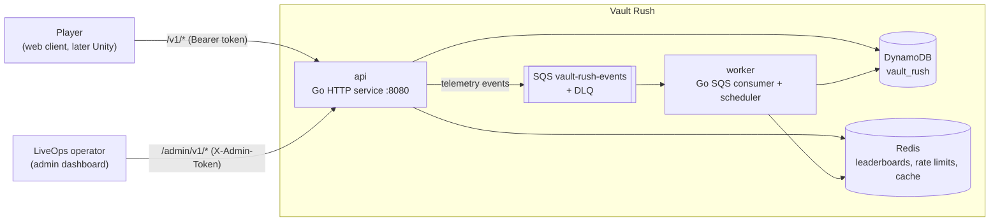
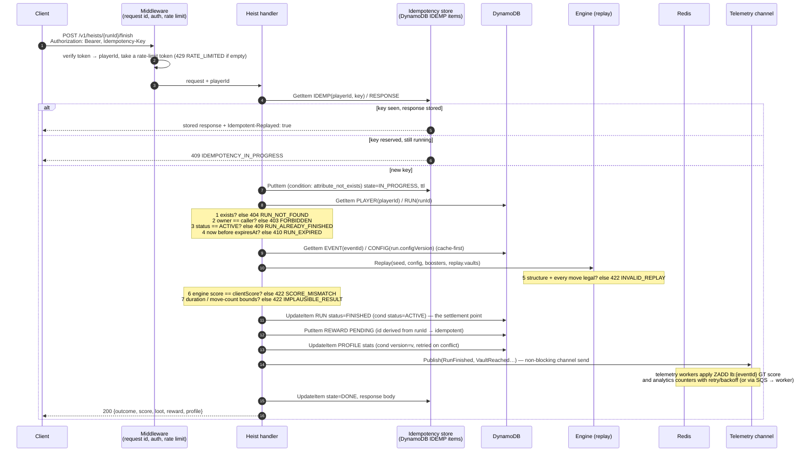
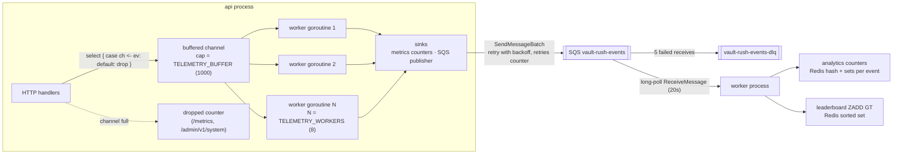
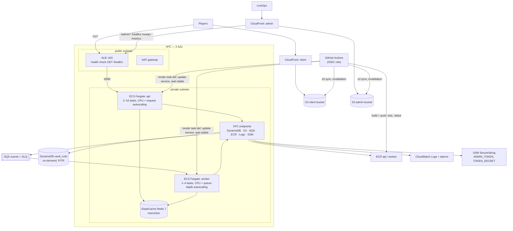
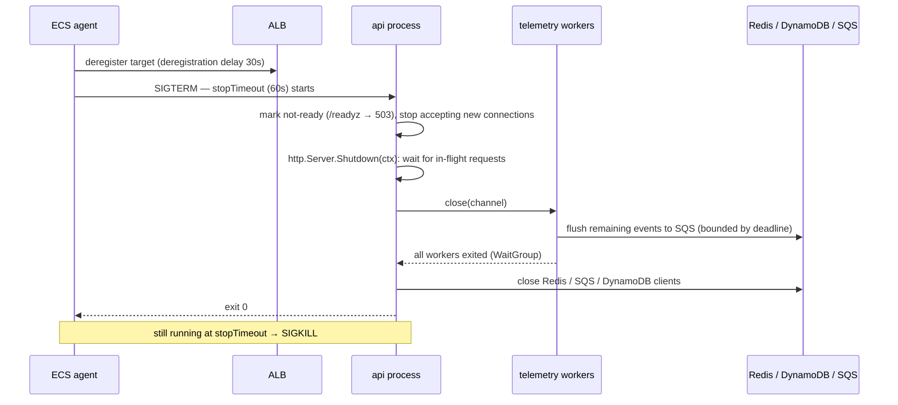

# Vault Rush — Architecture

Vault Rush is a casual heist-puzzle game whose interesting part is the backend: a Go API
that validates every run by replaying it, an asynchronous telemetry pipeline built on
channels and a worker pool, and an AWS deployment (ECS Fargate, DynamoDB, ElastiCache,
SQS) driven entirely from GitHub Actions. This document describes how the pieces fit
together. Decisions and their trade-offs are in [`decisions/`](decisions/); the API
contract is in [`api.md`](api.md); the engine in [`engine.md`](engine.md); day-to-day
operation in [`operations.md`](operations.md).

## 1. System context

| Component | Location | Role |
|-----------|----------|------|
| `api` | `backend/cmd/api` | Public HTTP API: players, events, heists, leaderboard, rewards, shop, admin. Owns the request path and the in-process telemetry pipeline. |
| `worker` | `backend/cmd/worker` | Consumes telemetry events from SQS (analytics counters, leaderboard updates) and runs the scheduled leaderboard-reward distribution job. Daily events are provisioned on demand by the API when first read. |
| `engine` | `backend/pkg/engine`, `client/src/engine` | Deterministic puzzle engine, implemented in Go and TypeScript, kept byte-identical by shared golden fixtures. |
| `client` | `client/` | Vite + TypeScript + HTML5 Canvas player client, static files. |
| `admin` | `admin/` | Vite + React LiveOps dashboard, static files, same-origin with the API's admin surface through a reverse proxy (nginx locally, CloudFront in production). |
| DynamoDB | single table `vault_rush` | Source of truth for players, runs, rewards, events, configs, idempotency records. |
| Redis | ElastiCache (local: `redis:7-alpine`) | Leaderboard sorted sets, rate-limit buckets, hot config cache. Reconstructable. |
| SQS | `vault-rush-events` / `-dlq` | Durable hand-off between the API's telemetry pipeline and the worker. |

Both binaries read the same configuration and switch their dependencies with three
environment variables so the same code runs against in-memory fakes, the local compose
stack, or AWS:

| Variable | Local (compose) | Production |
|----------|-----------------|------------|
| `STORAGE` | `dynamodb` (DynamoDB Local) or `memory` | `dynamodb` |
| `CACHE` | `redis` or `memory` | `redis` |
| `QUEUE` | `sqs` (ElasticMQ) or `inline` | `sqs` |

`inline` executes the worker's handlers in-process inside the API, so a single binary with
`STORAGE=memory CACHE=memory QUEUE=inline` is a complete, dependency-free instance — this is
what unit tests and the smoke test use.

## 2. Request path: finishing a heist

`POST /v1/heists/{runId}/finish` is the hottest write in the system and the one where
correctness matters most: it decides scores, rewards and leaderboard positions from
client-supplied data. The server never trusts `clientScore`; it replays the moves with
the authoritative engine and compares.

Points worth noting:

- The validation chain is ordered from cheapest to most expensive and from "client bug"
  to "client lying". Steps 1–4 are a single `GetItem`; step 5 is CPU (bounded by the
  plausibility limits on move count); steps 6–7 are arithmetic.
- The DynamoDB transaction is the commit point. Everything after it (Redis, telemetry)
  is derived state that can be rebuilt from the `RUN#` item.
- The engine runs the same code path as the client (`docs/engine.md`), so a legitimate
  client can never fail step 6. A `SCORE_MISMATCH` is either a client bug — caught by
  the cross-language golden test in CI — or a tampered request.

## 3. Telemetry pipeline

Gameplay events (`run_started`, `run_finished`, `reward_claimed`, `purchase`, ...) feed
the LiveOps analytics. They must never slow down or fail a player request, so publishing
is decoupled from delivery in two stages: an in-process channel with a worker pool, then
SQS to the worker binary.

Design rules:

1. **Publish never blocks.** The handler does a non-blocking send; if the channel is
   full the event is dropped and `telemetry.dropped` increments. A dropped analytics
   event is a known, visible loss; a slow `finish` response is a worse one (ADR-004).
2. **Workers retry.** Each goroutine pulls from the channel and delivers the event to
   every sink with exponential backoff (5 attempts, 50 ms base, 5 s cap), counting
   `retries`; a `Permanent` error skips retries. Delivery to SQS is at-least-once.
3. **Sinks tolerate redelivery where it matters.** Leaderboard writes use `ZADD GT`
   and unique-player tracking uses `SADD`, so a redelivered message cannot inflate a
   rank or a player count. Plain counters (runs started, score sums) are approximate
   under redelivery — an accepted trade-off for dashboard analytics, documented in
   ADR-004.
4. **Poison messages leave the queue.** After `maxReceiveCount = 5` a message moves to
   the DLQ and an alarm fires (`operations.md`, "DLQ replay").
5. **Observable.** `queueDepth`, `capacity`, `workers`, `processed`, `dropped`, `retries`
   are exposed on `/metrics` and `/admin/v1/system`.

With `QUEUE=inline` the SQS publisher is replaced by a direct call into the worker's
handlers, so the local stack and unit tests exercise the same handler code without a
queue.

## 4. Deployment topology (AWS)

Terraform in `infrastructure/terraform/` builds the stack below; GitHub Actions deploys
into it without long-lived credentials (OIDC).

| Concern | Implementation |
|---------|----------------|
| Ingress | ALB with HTTPS (ACM) and HTTP→HTTPS redirect; targets are Fargate task IPs on 8080. |
| Health | ALB checks `/healthz` (liveness) so a task with a degraded Redis stays in rotation; `/readyz` is for operators and rollouts. |
| Compute | Fargate tasks from distroless images, read-only root filesystem, `stopTimeout` 60s to allow a full drain. |
| Secrets | SSM SecureString parameters referenced by ARN from the task definition; decrypted by the ECS agent at task start. |
| Network | Tasks in private subnets; AWS APIs via VPC endpoints; Redis reachable only from the tasks' security group. |
| IAM | One task role per service: api may read/write the table and `sqs:SendMessage`; worker may also consume the queue and read the DLQ. No `Scan` for the api. |
| Autoscaling | api: CPU 60% and ALB requests-per-target; worker: CPU and `ApproximateNumberOfMessagesVisible`. |
| Deploy | Rolling with `minimumHealthyPercent=100`, `maximumPercent=200`, circuit breaker with automatic rollback. Terraform owns the task-definition template; the pipeline owns the running revision. |
| Static | Private S3 buckets behind CloudFront with Origin Access Control; SPA fallback via a CloudFront Function on the S3 behaviour only, so API error codes pass through untouched. |
| Alarms | ALB 5xx rate, unhealthy hosts, p95 latency; SQS DLQ not empty, oldest message age; Redis memory. |

## 5. Data model

One DynamoDB table, `vault_rush`, with `PK`/`SK` string keys, on-demand billing, TTL on
`ttl`, and one GSI. Every entity type is distinguished by its key prefix.

| PK | SK | Item | Notes |
|----|----|------|-------|
| `PLAYER#<playerId>` | `PROFILE` | Player profile | `version` counter for optimistic concurrency; coins, lives, boosters, stats, experimentGroup |
| `PLAYER#<playerId>` | `RUN#<runId>` | Heist run | `{eventId, seed, configVersion, boosters, status, startedAt, expiresAt}`; result fields after finish; `ttl` after finish |
| `PLAYER#<playerId>` | `REWARD#<rewardId>` | Reward | `status` PENDING→CLAIMED via conditional update |
| `DEVICE#<deviceId>` | `PLAYER` | Device lookup | `playerId`; makes `POST /v1/player` idempotent per device |
| `EVENT#<eventId>` | `META` | Event metadata | name, theme, startsAt, endsAt, `configVersion` (current); `GSI1PK=EVENT`, `GSI1SK=<startsAt>` |
| `EVENT#<eventId>` | `CONFIG#00017` | Config version | Immutable; zero-padded version so `CONFIG#` sorts numerically |
| `IDEMP#<playerId>#<key>` | `RESPONSE` | Idempotency record | `state` IN_PROGRESS/DONE, stored response, `ttl` |

Access patterns and how the key design serves them:

| Access pattern | Operation |
|----------------|-----------|
| Load profile before a mutation | `GetItem PLAYER#p / PROFILE` (`ConsistentRead`) |
| Resume player by device | `GetItem DEVICE#d / PLAYER` |
| Player's recent runs (admin) | `Query PK=PLAYER#p, SK begins_with RUN#`, descending, limit 20 — run ids are generated time-ordered |
| Player's rewards | `Query PK=PLAYER#p, SK begins_with REWARD#` |
| Current event config | `GetItem EVENT#e / META` → `GetItem EVENT#e / CONFIG#<v>` (cached in Redis) |
| Config history | `Query PK=EVENT#e, SK begins_with CONFIG#`, descending |
| Events by date window (admin, provisioning) | `Query GSI1: GSI1PK=EVENT, GSI1SK between <from> and <to>` |
| Idempotent finish | `GetItem` / conditional `PutItem` on `IDEMP#p#key / RESPONSE` |

The player partition (`PLAYER#p`) groups everything one player owns, so the finish
transaction (run + profile + reward) touches a single partition key and the admin's
player view is one `Query`. Leaderboard ranking is deliberately *not* modelled in
DynamoDB (ADR-003); the analytics aggregates the worker maintains live under the event
partition.

## 6. Consistency model

| Data | Guarantee | Mechanism |
|------|-----------|-----------|
| Profile | Linearizable per player | Consistent read + conditional `UpdateItem` on `version`; lost race → `409 VERSION_CONFLICT`, client refetches and retries |
| Run state | Exactly one finish | Conditional transition `ACTIVE → FINISHED`; second attempt → `409 RUN_ALREADY_FINISHED` (or an idempotent replay) |
| Reward claim | Exactly once | Conditional update `PENDING → CLAIMED`; loser → `409 REWARD_ALREADY_CLAIMED` |
| Idempotent finish | At-most-once effect per key | Conditional reservation of the idempotency record before any side effect |
| Leaderboard | Eventual | Written asynchronously by the telemetry pipeline after the DynamoDB commit (milliseconds inline, seconds via SQS); retried with backoff, DLQ after 5 receives (ADR-006) |
| Event config | Immutable versions | Safe to cache indefinitely by `(eventId, version)`; the `META` pointer is cached briefly |
| Analytics | Eventual, at-least-once input | Unique sets and `ZADD GT` are idempotent; plain counters may over-count on redelivery |

The response to `finish` always includes the authoritative score and the updated profile,
so a player sees their own result immediately even when their leaderboard rank is still
propagating.

## 7. Config versioning

LiveOps tunes the daily event while it is live ("vault 4 too hard, lower the lasers").
`PUT /admin/v1/events/{id}/config` never overwrites: it writes `CONFIG#<n+1>` and moves
the `META.configVersion` pointer. A run records the `configVersion` it started with, and
`finish` replays against exactly that version — otherwise a config change mid-run would
make every legitimate replay fail with `INVALID_REPLAY`. New runs pick up the new
version at `start`. Each version carries `createdBy` and `note`, which doubles as the
audit trail shown in the admin (ADR-007).

## 8. Idempotency

Mobile networks retry. `POST /v1/heists/{runId}/finish` accepts an `Idempotency-Key`
(UUID, recommended) scoped to the player:

1. Reserve `IDEMP#<playerId>#<key>` with a conditional put (`attribute_not_exists(PK)`).
   If it exists and is `DONE`, return the stored response with `Idempotent-Replayed: true`;
   if `IN_PROGRESS`, return `409 IDEMPOTENCY_IN_PROGRESS` so the client backs off.
2. Execute the request.
3. Store the response and mark `DONE`. The record carries a `ttl` so DynamoDB expires it.

Without a key, the run-state condition (`ACTIVE → FINISHED`) still prevents double
scoring; the client just receives `409 RUN_ALREADY_FINISHED` instead of the original
response. `POST /v1/player` is idempotent by construction through the `DEVICE#` item, and
`POST /v1/rewards/claim` through the conditional status flip.

## 9. Optimistic concurrency

The profile is mutated by several endpoints (start, finish, claim, purchase) and,
occasionally, by an admin grant at the same time. Every mutation reads the profile, computes
the new state, and writes with `ConditionExpression: version = :expected` and
`SET version = :expected + 1`. Nothing locks; the loser of a race gets
`409 VERSION_CONFLICT` and the client re-reads and retries. Contention on one player is
rare (one human), so retries are cheap and the write path stays a single conditional
request instead of a lock round-trip.

## 10. Rate limiting

A token bucket per player, `RATE_LIMIT_PER_MIN` (default 100) tokens per minute, keyed by
`playerId` in Redis so the limit holds across API tasks. Exceeding it returns
`429 RATE_LIMITED` with `Retry-After`. With `CACHE=memory` the bucket lives in the
process (a Lua script keeps it atomic in Redis). When Redis is unreachable the limiter
fails open: the request is allowed and a warning is logged, because refusing to serve
gameplay over a lost rate-limit bucket would be the worse failure.
Unauthenticated endpoints (`/healthz`, `POST /v1/player`) are limited per source IP at
the ALB/CloudFront layer rather than in the application.

## 11. Fault tolerance

| Failure | Effect | Behaviour |
|---------|--------|-----------|
| Redis unavailable | `/readyz` → 503 (`deps.redis`); leaderboard reads → `503 DEPENDENCY_UNAVAILABLE`; rate limiter fails open | Runs still start and finish: DynamoDB is the source of truth. Leaderboard/analytics writes are retried by the pipeline with backoff; in SQS mode the message returns to the queue and lands in the DLQ after 5 receives, from where it can be replayed (`operations.md`). |
| Redis memory full | `ZADD` fails (`noeviction`) | Same as unavailable for writes; reads keep working; memory alarm at 80%. Chosen over silent eviction of ranking keys. |
| DynamoDB unavailable / throttled | Writes fail | The API returns `503 DEPENDENCY_UNAVAILABLE` (AWS SDK errors are mapped explicitly). The finish path is an ordered sequence of conditional, idempotent writes (run → reward → profile), so a client retry with the same `Idempotency-Key` completes whatever remained. The SDK retries transient throttling. |
| SQS unavailable | Telemetry publisher retries with backoff; channel fills; events drop | Gameplay unaffected. `telemetry.retries` and `telemetry.dropped` climb and are visible on `/metrics`; analytics for that window are incomplete and the loss is quantified. |
| Worker down | Queue backlog grows | Nothing user-facing. `ApproximateAgeOfOldestMessage` alarm fires; queue-depth autoscaling adds tasks when the worker is merely slow. |
| API task crash | ALB removes the target after 3 failed checks; ECS replaces the task | In-flight requests on that task fail; idempotency keys let clients retry safely. |
| Bad deploy | Circuit breaker | ECS rolls back to the previous task definition when new tasks fail to become healthy. |

## 12. Graceful shutdown

Every deploy and scale-in sends SIGTERM to API tasks. The shutdown sequence is designed
to lose neither an in-flight `finish` nor the telemetry already accepted into the channel.

Time budget (inside the 60s `stopTimeout`): the HTTP drain and the telemetry flush share
one 20 s deadline (`shutdownTimeout` in `cmd/api/main.go`), then dependencies close. The worker binary follows the same
pattern: stop polling, finish the messages it holds (visibility timeout 60s covers the
processing budget), exit.

## 13. Observability

- **Request id**: every response carries `X-Request-Id`; incoming ids are propagated so
  a client-reported failure can be traced through the API and the worker logs.
- **Structured logs**: JSON to stdout, shipped by `awslogs` to CloudWatch (`/vault-rush-prod/api`,
  `/vault-rush-prod/worker`), retention 30 days.
- **`/metrics`**: JSON counters — request counts by route and status, latency histogram,
  telemetry queue depth/processed/dropped/retries, sink retries, dependency status. The
  admin's system panel renders `GET /admin/v1/system`, which is the same data plus build
  version and uptime.
- **CloudWatch alarms** (Terraform): ALB 5xx %, unhealthy hosts, p95 latency; DLQ not
  empty, oldest message age; Redis memory. Alarm actions are an SNS topic passed in as a
  variable.
- **Load tests**: `load-tests/k6/`, results in `load-testing.md`.

## 14. Security notes

- Player identity is a bearer token minted by `POST /v1/player` and signed with
  `TOKEN_SECRET`; there is no password. The token binds a device to a `playerId`.
- The admin surface requires `X-Admin-Token`, compared in constant time, and is only
  reachable through the admin distribution / nginx proxy paths.
- Secrets never appear in task definitions or images: SSM SecureString → ECS `secrets`.
- Images are distroless, run as `nonroot`, and the root filesystem is read-only.
- The API has no `dynamodb:Scan`; the worker has it only for reconciliation.
- Redis is reachable solely from the ECS tasks' security group.
